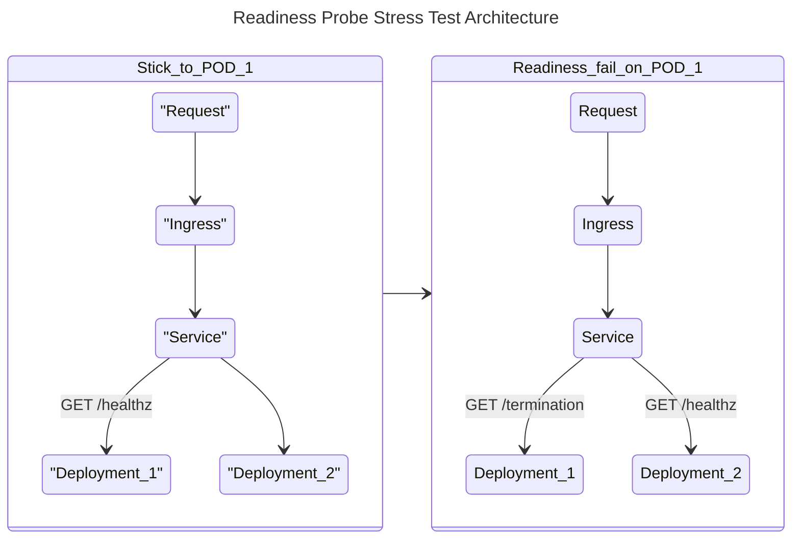

```mermaid
---
title: Readiness Probe Stress Test Architecture
---
stateDiagram-v2
    direction LR
    Stick_to_POD_1 --> Readiness_fail_on_POD_1
    state Stick_to_POD_1{
        "Request" --> "Ingress"
        "Ingress" --> "Service"
        "Service" --> "Deployment_1": GET /healthz
        "Service" --> "Deployment_2"
    }
    state Readiness_fail_on_POD_1{
        Request --> Ingress
        Ingress --> Service
        Service --> Deployment_1: GET /termination
        Service --> Deployment_2: GET /healthz
    }
```
